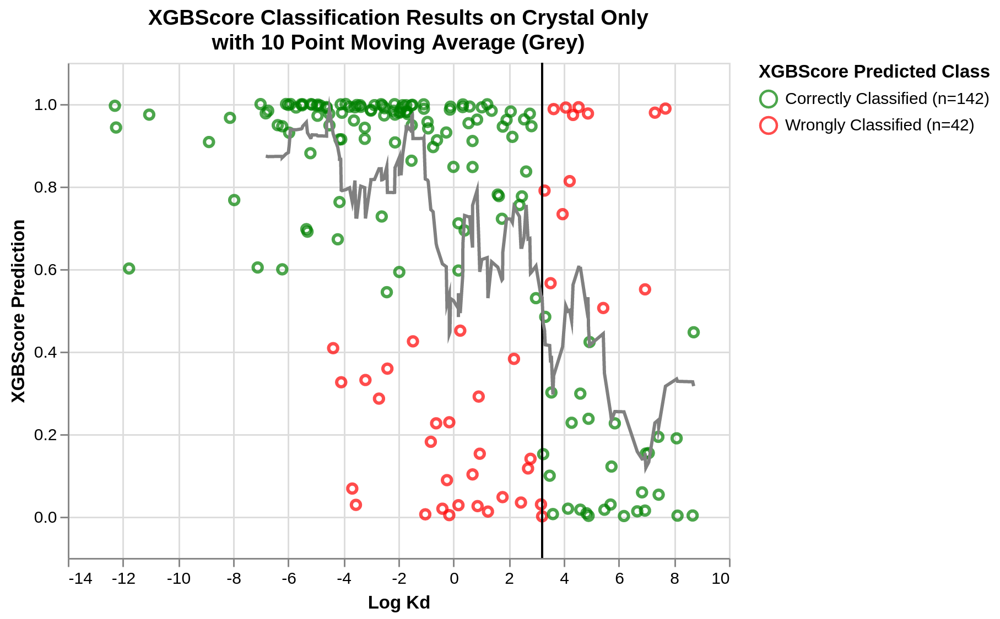

# **XGBScore: A Gradient Boosted Decision Tree Scoring Function for Structure Based Virtual Screening**

*Gif sourced from https://azevedolab.net/*

This project aims to use gradient boosted decision trees for binary classification of protein-ligand Kd. The model uses XGBoost and scikit-learn, and was trained on active data from the following databases:
- Binding MOAD
- PDBBind
- Iridium

And decoy data generated by [**OxPIG's DeepCoy**](https://github.com/oxpig/DeepCoy)

The project was a success, as can be seen by the evaluaton of the scoring function on unseen crystal structures:

Please see my [**lab book**](https://github.com/miles-mcgibbon/XGBScore/blob/main/labbook/Labbook.ipynb) for explanations of the scripts in this repository, details of the work performed and detailed results of the scoring function.
